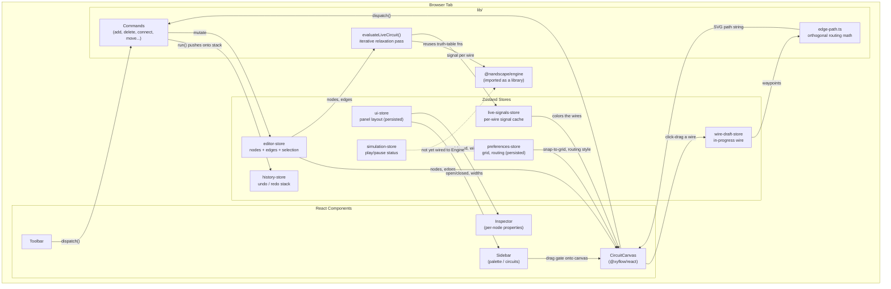

# Nandscape — How the Web App Actually Works

This is a guided tour of `apps/web`, the Next.js app that people actually click around in. It's written for anyone new to the codebase — an intern, a junior dev, a contributor who just cloned the repo and wants to know where things live before touching anything.

The `packages/engine` package (the actual event-driven logic simulator) has its own `ARCHITECTURE.md` and isn't repeated here. This document only cares about one question: **how does the app talk to the engine, and what's everything else doing?** Short answer, spoiler: right now, mostly, it isn't talking to the engine yet. Keep reading — that's more interesting than it sounds.

---

## Table of contents

1. [The stack, in one paragraph](#1-the-stack-in-one-paragraph)
2. [The big picture diagram](#2-the-big-picture-diagram)
3. [Folder tour](#3-folder-tour)
4. [State management: seven small stores instead of one big one](#4-state-management-seven-small-stores-instead-of-one-big-one)
5. [The Command pattern: how undo/redo actually works](#5-the-command-pattern-how-undoredo-actually-works)
6. [The canvas: React Flow, and everything bolted onto it](#6-the-canvas-react-flow-and-everything-bolted-onto-it)
7. [The "live simulation": the part that makes the wires light up](#7-the-live-simulation-the-part-that-makes-the-wires-light-up)
8. [The registry pattern, used five different times](#8-the-registry-pattern-used-five-different-times)
9. [Wire routing: two small geometry algorithms](#9-wire-routing-two-small-geometry-algorithms)
10. [Data structures, summarized](#10-data-structures-summarized)
11. [The engine boundary — what's wired up and what isn't](#11-the-engine-boundary--whats-wired-up-and-what-isnt)
12. [Styling and theming](#12-styling-and-theming)
13. [Routes and pages](#13-routes-and-pages)
14. [Things that are clearly unfinished (and that's fine)](#14-things-that-are-clearly-unfinished-and-thats-fine)
15. [Glossary](#15-glossary)

---

## 1. The stack, in one paragraph

Nandscape's frontend is a **Next.js 16** app (App Router, React 19) using **`@xyflow/react`** (React Flow) as the node-and-wire canvas, **Zustand** for state, and **Tailwind CSS v4** for styling. There's no Redux, no Context-API-as-a-state-manager, no GraphQL layer, no backend calls at all as far as this codebase goes — everything lives in memory in the browser tab. The whole thing is one pnpm workspace with two packages: `apps/web` (this app) and `packages/engine` (the simulator library, imported as `@nandscape/engine`).

If you've used a visual node editor before — Blender's shader nodes, Unreal's Blueprints, n8n, Figma's plugin canvas — the shape of this app will feel familiar immediately. You drag gates from a palette onto a canvas, wire them together, and (eventually) watch signals propagate.

## 2. The big picture diagram



The one arrow worth staring at is the dotted one at the bottom. `simulation-store` exists, has a `compileAndAttach(simulator)` method, and clearly wants to hold a real `Simulator` instance from the engine — but nothing in the app currently calls it. Play/Pause in the toolbar right now just flips a status flag. More on that in [section 11](#11-the-engine-boundary--whats-wired-up-and-what-isnt).

## 3. Folder tour

```
apps/web/
├── app/                     Next.js App Router pages (routes)
├── components/
│   ├── editor/              Everything specific to the circuit editor
│   │   ├── canvas/          The React Flow wrapper + wire-drafting logic
│   │   ├── context-menu/    Right-click menu (registry-driven)
│   │   ├── dialogs/         Modal system (currently empty, ready to grow)
│   │   ├── edges/           Wire rendering
│   │   ├── inspector/       Right-hand "properties" panel
│   │   ├── layout/          Resizable panel shell
│   │   ├── nodes/           Gate and I/O node rendering + factories
│   │   ├── overlays/        Absolutely-positioned UI drawn over the canvas
│   │   ├── sidebar/         Gate palette + saved-circuits list
│   │   └── toolbar/         Top toolbar
│   ├── ui/                  Small, dumb, reusable primitives (Led, Badge, ToggleSwitch...)
│   └── (marketing bits)     Hero, Navbar, PuzzleCard — the landing page
├── hooks/                   use-command, use-keyboard-shortcuts, use-live-simulation
├── lib/
│   ├── commands/            The Command pattern implementation
│   ├── editor/               Pure logic: live simulation, edge geometry, gate defaults, starter circuits
│   └── keyboard/             Keyboard shortcut table + resolver
├── store/                   The seven Zustand stores
└── types/editor.ts          The shared type vocabulary for the whole editor
```

The naming is consistent on purpose: almost every folder under `components/editor/` pairs with a same-named concept in `lib/` or `store/`. If you're looking for the logic behind a UI piece, check the sibling folder in `lib/` first.

## 4. State management: seven small stores instead of one big one

A lot of node-editor apps make the mistake of putting everything — graph data, UI chrome, undo history, user prefs — into one giant store. Nandscape deliberately splits it into **seven Zustand stores**, each with one job:

| Store | Owns | Persisted? |
|---|---|---|
| `editor-store` | nodes, edges, current selection | No |
| `history-store` | the undo/redo stack (a list of `Command` objects) | No |
| `ui-store` | which panels are open, their widths/heights, the active tab, context menu position | Yes (localStorage) |
| `preferences-store` | snap-to-grid, grid size, wire routing style, animations | Yes (localStorage) |
| `simulation-store` | play/pause/step status and the (eventually) attached `Simulator` | No |
| `live-signals-store` | the per-wire signal cache used to color wires right now | No |
| `wire-draft-store` | the in-progress wire while you're click-routing a connection | No |

Why bother splitting it up like this? A few reasons that show up directly in the code:

- **Undo history should only remember structural edits.** Resizing the sidebar shouldn't create an undo step. Because panel width lives in `ui-store` and circuit structure lives in `editor-store`, that separation is automatic — nobody has to remember to exclude UI actions from history, because UI actions never touch the store history listens to.
- **`editor-store` is deliberately "dumb."** Read the comment at the top of that file — it says outright that this store exposes low-level graph primitives (`addNode`, `connect`, `removeNodes`) but knows nothing about *when* those should happen or what should be undoable. That decision-making lives one layer up, in Commands. This is a classic separation of "mechanism" from "policy": the store knows *how* to add a node, the command layer knows *when* and *whether it should be undoable*.
- **Two stores track "what's the wire's signal right now" for two different reasons.** `live-signals-store` is the always-on preview (see section 7). `simulation-store.signalByEdgeId` is meant for the real, eventually-wired engine run. They look similar but exist for different futures — one is live today, one is scaffolding.

All the stores are just `create<T>((set, get) => ({ ... }))` from Zustand — no middleware beyond `persist` on the two that need it. There's no selector-memoization library in play; components subscribe to just the slice of state they need (e.g. `useEditorStore((s) => s.nodes)`), which is what keeps re-renders cheap without any extra machinery.

## 5. The Command pattern: how undo/redo actually works

This is worth understanding well, because it's the backbone of every structural edit in the app — add a gate, delete a selection, connect a wire, load a starter circuit, all of it goes through the same shape.

A **Command** is just an object with an `execute()` function and, optionally, an `undo()` function:

```ts
export interface Command<TResult = void> {
  id: string;
  label: string;
  execute: (ctx: CommandContext) => TResult;
  undo?: (ctx: CommandContext) => void;
  undoable?: boolean;
}
```

Each concrete command (in `lib/commands/commands/`) is a small factory function — `createAddNodeCommand(node)`, `createDeleteSelectionCommand()`, `createConnectEdgeCommand(connection)` and so on — that closes over whatever data it needs and returns an object matching that shape. The closure is the interesting bit: it's how `undo()` knows what to restore.

Take `createDeleteSelectionCommand`. Before deleting anything, it snapshots the nodes and edges that are about to disappear into local variables (`removedNodes`, `removedEdges`), *including* any wires that get cascade-deleted because their node went away. `undo()` just puts that exact snapshot back. This matters more than it sounds — if undo just "re-added the nodes," any wires that were attached to them would still be gone. Capturing a full snapshot up front, rather than diffing before/after, is what makes a single undo step restore the whole picture, wires included.

Once built, a command doesn't run itself — something has to call `useHistoryStore.getState().run(command)`. That's the only place `execute()` actually gets called for a structural edit, and it's also the only place that decides whether to push the command onto the undo stack (only if `undoable === true`). Every entry point — the toolbar buttons, the right-click menu, keyboard shortcuts — funnels through the same `useCommandDispatch()` hook, which is just a thin wrapper around that `run()` call. That's a strong rule worth internalizing: **UI code should never call `useEditorStore.getState().addNode(...)` directly.** If it does, that edit silently skips undo history.

Undoing pops the last command off the `past` array and calls its `undo()`, then pushes it onto `future`. Redoing does the reverse. Running a *new* command after an undo clears `future` — the same behavior you'd expect from any text editor. The stack is capped at 200 entries so a long editing session doesn't grow memory forever.

One more small but deliberate detail: **not every command is undo-worthy, and not every user action needs to *be* a command.** Dragging a node around the canvas updates its position continuously through React Flow's own `onNodesChange` (wired straight into `editor-store`), with zero history involvement, so dragging stays smooth at 60fps. Only when the drag *ends* does the canvas build one `MoveNodesCommand` covering the net from/to position — so undo is one step per drag, not one step per animation frame.

## 6. The canvas: React Flow, and everything bolted onto it

`components/editor/canvas/circuit-canvas.tsx` is the only file in the whole app that imports from `@xyflow/react` directly for rendering the graph — every other file that needs to know about nodes and edges goes through `editor-store`. That's a nice boundary: if the app ever swapped out React Flow for something else, this is the one file that would need a rewrite.

A few things worth knowing about how it's wired:

**Dragging a gate from the sidebar onto the canvas** uses the plain HTML5 drag-and-drop API (`draggable`, `onDragStart`, `onDrop`) rather than a drag library. The palette item serializes itself to JSON and stuffs it into `event.dataTransfer` under a custom MIME type (`application/nandscape-node`). The canvas's `onDrop` handler reads that back out, converts the screen coordinates to canvas coordinates with React Flow's `screenToFlowPosition`, and dispatches an `AddNodeCommand`.

**Connecting wires works two different ways, and both end at the same command.** The obvious way is: drag from one pin, drop on another — React Flow's normal `onConnect` handles that. But Nandscape also supports *click-to-route*: click a pin once to start a wire, click empty space to drop waypoints (so the wire bends around other gates), then click a compatible pin to finish. That whole flow lives in `wire-draft-store` plus a handful of pointer-event handlers in the canvas (`handleConnectStart`, `handleConnectEnd`, `handleWrapperPointerUp`). Whichever path you take, you land at the same `createConnectEdgeCommand(connection, waypoints)` call — the two input methods are just two ways of building the same command payload.

**A drag vs. a click is disambiguated by distance, not by a timer.** Look at `CLICK_THRESHOLD_PX = 6`. When a connect gesture ends, the code measures the pixel distance between where it started and where it ended (`Math.hypot(dx, dy)`); under 6px counts as a click (advance the wire draft), over that counts as a drag-and-release-on-empty-space (abort). This is a small but genuinely useful pattern any time you need to tell "the user clicked" from "the user dragged and let go" using pointer events.

**Node and edge type registries keep `circuit-canvas.tsx` from ever growing a big switch statement.** It just imports `nodeTypes` and `edgeTypes` — plain objects mapping a string key (`"gate"`, `"io-input"`, `"wire"`) to a component — and hands them to React Flow. Adding a new node kind means adding one line to that map, not touching the canvas file. More on this pattern in section 8.

## 7. The "live simulation": the part that makes the wires light up

This is arguably the cleverest small piece of code in the app, and it's easy to miss because it's tucked away in `lib/editor/live-simulate.ts`.

Here's the problem it solves: you want wires to change color the instant you toggle an input or draw a new connection — no "press play" step, just instant feedback, the way a spreadsheet recalculates the moment you edit a cell. But the *real* simulator (`@nandscape/engine`'s `Simulator` class) is event-driven and needs to be explicitly compiled and stepped through time — not something you want to spin up on every keystroke just to preview a NAND gate's output.

So the app has a second, much simpler evaluator, `evaluateLiveCircuit(nodes, edges)`, that runs a full recompute from scratch every time the graph changes. Here's the actual algorithm:

1. Build two lookup maps from the edge list: which edges feed *into* each node (`incomingByTarget`), and which edges come *out of* each node's specific output pin (`outgoingBySourceHandle`).
2. Every wire starts at `SignalState.FLOAT` (undriven).
3. Loop over every node up to **6 times** (`MAX_PASSES`). On each pass: inputs and constants drive their fixed value; gates read their current input wires and push a freshly computed output through the engine's own truth-table functions (`evaluateAnd`, `evaluateNand`, `evaluateXor`, ...).
4. Return the final signal for every wire.

Why 6 passes and not "just evaluate once"? Because the graph can have loops and multi-level chains. Picture two NAND gates cross-wired into each other to form an SR latch (there's literally one of these in `default-circuits.ts`) — you can't resolve gate A's output without knowing gate B's output, and vice versa. Repeating the pass lets values propagate and settle, the same way spreadsheet engines resolve dependent cells over multiple iterations. Six passes is enough for the depth of circuit this editor currently supports; it's a pragmatic cap, not a rigorously derived one, and the code says so directly in its own comments.

This is why the function is called *point-to-point* rather than net-aware: it tracks one signal value per **wire (edge)**, not per **electrically-connected net**. A "real" simulator has to handle multiple wires meeting at a junction and resolving conflicts (two drivers disagreeing = contention = unknown state) — this preview evaluator sidesteps that by keeping each connection independent, which is a reasonable simplification until subcircuits or fan-out get more complex.

Two more honest limitations, both called out in the code's own comments:
- Sequential parts — flip-flops, latches, clocks — aren't evaluated here at all, because they need actual event ordering (a flip-flop's output depends on *when* its clock ticked, not just its current inputs). Their outputs just stay FLOAT in this preview until the real engine bridge exists.
- Reusing the engine's own `evaluateNand`/`evaluateXor`/etc. functions (rather than reimplementing truth tables in the app) is deliberate — it guarantees the instant preview and the eventual real simulation will never disagree about what a gate does.

The `useLiveSimulation()` hook just calls this function inside a `useEffect` whenever `nodes` or `edges` change, and stores the result in `live-signals-store`. Wire and I/O components then read from that store to decide their color. It runs unconditionally — completely independent of the Play/Pause button, which belongs to a different, not-yet-connected system (see section 11).

## 8. The registry pattern, used five different times

Once you notice this pattern once, you'll see it everywhere in this codebase, and it's a genuinely good habit to copy in your own projects. The shape is always the same: **instead of a growing `if`/`switch` inside one component, maintain a plain object or `Map` from "kind of thing" to "what handles it," and let new kinds register themselves.**

| Registry | Maps | Lives in |
|---|---|---|
| `nodeTypes` | node kind → React component | `nodes/node-registry.tsx` |
| `edgeTypes` | edge kind → React component | `edges/edge-registry.ts` |
| `inspectorPanelRegistry` | node kind → properties-panel component | `inspector/inspector-registry.ts` |
| `commandRegistry` | command id → `Command` object | `commands/registry.ts` |
| `shortcutRegistry` | key combo string → command id | `keyboard/shortcut-registry.ts` |
| context menu builders | target type (node/edge/pane) → menu items | `context-menu/context-menu-registry.ts` |

Take the inspector as the clearest example. `inspector.tsx` doesn't know what a "gate" is or how to render its properties. It just looks up `inspectorPanelRegistry[selectedNode.data.kind]`, and if nothing's registered for that kind, it falls back to a generic "not editable yet" panel. Today only `"gate"` has an entry (`GateInspectorPanel`). Adding a properties panel for, say, a future "constant" node type means adding one line to that map — the `Inspector` component itself never needs to change.

The command registry plus shortcut registry combination is worth calling out specifically, because it's a clean two-layer indirection: a keyboard event gets normalized into a combo string like `"mod+z"` (where `"mod"` abstracts Cmd-on-Mac vs. Ctrl-elsewhere), that string is looked up in `shortcutRegistry` to get a command *id*, and that id is looked up in `commandRegistry` to get the actual runnable command. Neither registry needs to know about the other's internals, and a future "keyboard shortcuts" settings screen could list every binding just by calling `shortcutRegistry.list()`.

## 9. Wire routing: two small geometry algorithms

Two functions in `lib/editor/edge-path.ts` do all the routing math for click-routed wires (the ones with user-placed bends, as opposed to React Flow's automatic bezier/smoothstep/straight paths).

**Building the path (`buildOrthogonalPath`)** takes an ordered list of points — source, then each waypoint, then target — and connects each consecutive pair with an "elbow": a horizontal segment then a vertical one, in classic circuit-diagram style. It's implemented as a straightforward SVG path string builder: for each point after the first, it draws a line to `(currentX, previousY)` and then to `(currentX, currentY)`. No third-party path library, just string concatenation.

**Finding where to insert a new waypoint (`nearestSegmentIndex`)** solves a slightly more interesting problem: when you double-click on a wire to add a bend, which segment did you actually click near? This uses standard point-to-line-segment distance:

```
project the click point onto each segment (clamped to the segment's ends),
measure the distance to that projection,
keep the segment with the smallest distance.
```

That's the classic "closest point on a line segment" formula (`distanceToSegment`), applied against every straight-line pair in the points array (not the rendered elbows — close enough for picking a sensible insertion index without extra complexity). Whichever segment index wins doubles as the array index to splice the new waypoint into.

Both functions are pure, have no dependencies on React or Zustand, and are trivially unit-testable — which is exactly what you want from geometry code buried inside a UI-heavy component tree.

## 10. Data structures, summarized

A quick reference for the shapes you'll run into constantly while reading this code:

- **`EditorNode` / `EditorEdge`** — these are just React Flow's generic `Node<T>` and `Edge<T>` types, parameterized with Nandscape's own data shapes (`EditorNodeData`, `WireEdgeData`). A node's `data.kind` (`"gate"`, `"input"`, `"output"`, `"constant"`, `"clock"`, `"subcircuit"`, `"note"`) is a discriminated union tag — TypeScript narrows the type automatically once you check it, which is why you'll see `switch (node.data.kind)` blocks all over the codebase.
- **`Selection`** — just `{ nodeIds: string[], edgeIds: string[] }`. Nothing fancier; multi-select is represented as two parallel arrays of ids.
- **`Command<T>`** — covered in section 5. The important structural detail: undo state is captured in the closure of the factory function, not stored anywhere globally, so commands are self-contained and don't need a companion "undo data" table elsewhere.
- **`WireDraft`** — the in-progress click-routed wire: which pin it started from, an ordered array of waypoints, and the current cursor position (used to draw the dashed preview line before the wire is finalized).
- **Branded IDs in the engine** (`GateId`, `PinId`, `NetId`, `EventId`) — worth knowing about even though they live in `packages/engine`, because the app imports and passes these types around. They're plain numbers at runtime (cheap, array-index-friendly) but TypeScript treats them as distinct types via a phantom `__brand` field, so you can't accidentally pass a `PinId` where a `NetId` is expected. It costs nothing at runtime and catches a real class of bugs at compile time.
- **`SignalState`** — a 4-value enum: `LOW`, `HIGH`, `FLOAT`, `UNKNOWN`. The app's own `evaluateLiveCircuit` reuses this exact enum (imported from the engine) rather than inventing its own two-value boolean signal — which is *why* the instant preview and the real simulator will never disagree about what a wire's state means.

## 11. The engine boundary — what's wired up and what isn't

This section exists because an accurate map of a codebase has to show the parts that are still under construction, not just the parts that work.

**What genuinely talks to `@nandscape/engine` today:**
- `lib/editor/live-simulate.ts` imports the engine's `SignalState`, `GateType`, and the pure gate-evaluation functions (`evaluateAnd`, `evaluateNand`, etc.) and reuses them for the instant preview.
- Type definitions (`SignalState`, `GateType`, helper functions like `gateTypeToString`, `isSequential`, `isCombinational`) are imported all over the UI layer — node rendering, the inspector, wire coloring — purely as shared vocabulary.
- `gate-defaults.ts` mirrors the engine's fixed pin-arity conventions (a `NOT` gate has one input, a `D_FLIP_FLOP` has four named ones) so newly placed nodes get the right number of pins.

**What exists as scaffolding but isn't connected yet:**
- `simulation-store` has a `compileAndAttach(simulator: Simulator)` method and a `status` state machine (`idle` → `compiling` → `running` → `paused` → `error`) clearly designed to hold a live instance of the engine's actual event-driven `Simulator` class. Nothing in the app currently constructs a `Simulator` or calls `compileAndAttach`.
- The toolbar's Play/Pause button toggles `simulation-store.status` between `"running"` and `"paused"` — but since no simulator is attached, this currently doesn't advance anything. It's a real button wired to a real store, just waiting for the compiler step that turns an `editor-store` graph into an engine `CircuitData` object.
- The "Truth table" and "Waveform" tabs in the inspector and bottom panel are visible, clickable, and explicitly labeled as placeholders ("generated from simulation once compile-circuit.ts lands").

If you're picking up a task in this codebase, "build the bridge between `editor-store`'s graph and the engine's `Simulator`" is very likely the single highest-leverage piece of unfinished work here — everything else in the editor (undo history, wire drafting, the palette, the inspector) is built and just waiting for real signals to visualize.

## 12. Styling and theming

Tailwind CSS v4 is configured through `app/globals.css` using the newer `@theme inline` block rather than a `tailwind.config.js` — colors are defined once as CSS custom properties under `:root` and `.dark` (e.g. `--signal-green`, `--copper`, `--surface-card`), then mapped into Tailwind's own token namespace (`--color-signal-green: var(--signal-green)`), which is what makes utility classes like `bg-signal-green` or `text-copper-dark` available and automatically theme-aware.

Dark mode is handled by `next-themes`, toggled via a `.dark` class on `<html>`, with `colorScheme: "system"` as the default so a fresh visit respects the OS setting. Every themed color in the app — including signal colors on wires and LEDs — flows through this same custom-property system, so a new component almost never needs its own light/dark conditional; it just uses the semantic class name (`bg-surface-card`, `border-border-strong`) and the swap happens for free.

Three Google Fonts are loaded through `next/font`: **Space Grotesk** for display headings, **Inter** for body text, and **JetBrains Mono** for anything code-like (gate labels, ids, badges) — a fairly standard "geometric display + humanist body + monospace for data" pairing for a technical product.

## 13. Routes and pages

The App Router structure is small and mostly self-explanatory:

- `/` — the marketing homepage (`Hero`, `Navbar`). Includes a `PuzzleCard` component that's a fully client-rendered, self-contained *fake* half-adder demo (its own `useState` for two inputs, its own inline NAND-based logic, a blurred static SVG circuit diagram in the background) — it's a landing-page illustration, not connected to the real editor or engine at all.
- `/nandbox` — the actual circuit editor. Just mounts `<CircuitEditor />`, which is the component covered throughout this whole document.
- `/puzzles` and `/learn` — currently just render the `Navbar` with nothing else. Placeholders for a puzzle-selection screen and a tutorial/learning path, respectively.
- `/test` — a scratch route rendering `HeroGradient`, presumably used while iterating on the homepage's background visual.

## 14. Things that are clearly unfinished (and that's fine)

Reading through this codebase, several commands and buttons openly log a message like `"[nandscape] selection.duplicate: not implemented yet"` instead of quietly failing or being hidden. That's a genuinely good practice worth calling out — a disabled or missing feature that silently does nothing is far more confusing to debug than one that says exactly what's missing. If you're looking for a good first contribution, the honest placeholders in `registered-commands.ts` (duplicate, copy, paste, save) are a clearly marked todo list.

Also unfinished, in rough order of how much they'd unlock:
1. **Compiling an editor graph into an engine `CircuitData` and attaching a real `Simulator`** (section 11) — the big one.
2. **Copy/paste and duplicate** — the commands exist as named stubs; the actual clipboard logic doesn't.
3. **A layers panel** — the sidebar tab exists and shows a one-line placeholder message.
4. **Truth table and waveform views** — same story, waiting on the simulation bridge.
5. **Subcircuits** — the `SubcircuitNodeData` type and `"subcircuit"` node kind exist in `types/editor.ts`, but there's no factory, registry entry, or rendering component for it yet.

## 15. Glossary

- **Node** — anything placed on the canvas: a gate, an input/output terminal, a constant, a clock. Comes from React Flow's vocabulary.
- **Edge** — a wire connecting two nodes. Same React Flow origin, renamed "wire" conceptually throughout the UI.
- **Handle** — the little circular connection point on a node where a wire can attach; React Flow term, wrapped here by `NodeHandle`.
- **Waypoint** — a user-placed bend point along a wire, used for manual click-routing instead of an automatic curve.
- **Net** — an engine-level concept: a fully connected group of pins that all share one electrical signal. The app's live preview intentionally does *not* model nets, only per-wire signals (see section 7).
- **Signal state** — one of `LOW`, `HIGH`, `FLOAT`, `UNKNOWN`. Four values instead of a plain boolean, so the simulator (and this app's preview) can represent "disconnected" and "conflicting drivers" as real, distinct states rather than defaulting them to a guess.
- **Command** — a self-contained, undoable unit of work (see section 5). Not related to a CLI command or a Redux action, though it plays a similar role.
